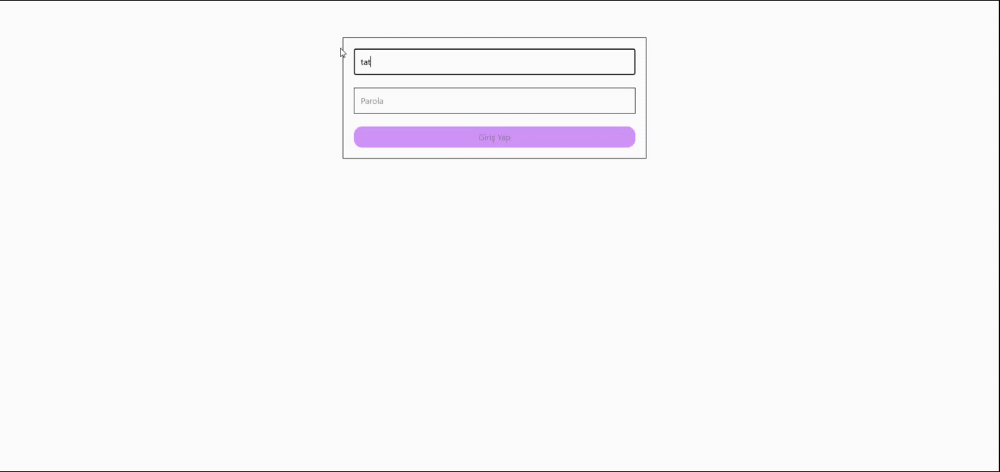

# 🔐 Firebase Auth App

Bu proje, Firebase Authentication kullanılarak geliştirilmiş kullanıcı kayıt, giriş ve profil yönetimi özelliklerine sahip modern bir web uygulamasıdır.

---

## 🚀 Features

- 🔐 Kullanıcı kayıt ve giriş sistemi
- 📧 E-posta doğrulama (email verification)
- 👤 Profil güncelleme (isim ve fotoğraf)
- 🔄 Gerçek zamanlı kullanıcı durumu yönetimi
- 🔔 Hata ve işlem bildirimleri (toast)
- 📱 Responsive tasarım

---

## 🛠️ Tech Stack

- React
- JavaScript (ES6+)
- Firebase Authentication
- Redux Toolkit
- React Router DOM
- Tailwind CSS
- Vite

---

## 📦 Libraries

- Firebase – kimlik doğrulama ve kullanıcı yönetimi
- Redux Toolkit – global state yönetimi
- React Redux – state erişimi
- React Router DOM – sayfa yönlendirme
- React Hot Toast – bildirim sistemi

---

## 🧠 Project Overview

Bu proje, modern web uygulamalarında kullanıcı kimlik doğrulama süreçlerini öğrenmek ve uygulamak amacıyla geliştirilmiştir.

Kullanıcılar:

- kayıt olabilir
- giriş yapabilir
- e-posta doğrulaması gerçekleştirebilir
- profil bilgilerini güncelleyebilir

---

## 🌍 Overview

This project is a modern authentication-based web application built with React and Firebase. It allows users to register, log in, verify their email, and update their profile information.

The application demonstrates real-world user authentication flows, global state management with Redux, and a clean, responsive UI.

Technologies used include React, Firebase Authentication, Redux Toolkit, and Tailwind CSS.

---

